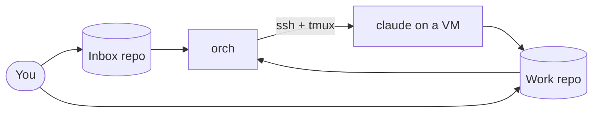

# orchid

Open a GitHub issue → orchid spawns a `claude` session on a free VM → claude opens a PR → orchid relays reviews and CI back to the pane → PR merged → session torn down.

Single Go binary. HCL config. No webhooks. Polls GitHub via `gh`, drives machines via SSH and tmux.

---

## Architecture



You label an issue in the inbox. orch polls, spawns a claude session on a
free VM, and pastes a bootstrap prompt. Claude pushes commits and opens a
PR in the work repo. You review there. orch keeps polling the PR and
relays new reviews / CI back into the session until the PR merges, then
tears the session down.

Everything is poll-driven on one ticker (default 30s). No webhooks.

---

## Quick start

```sh
go build -o orch .
GH_TOKEN=$(gh auth token) ./orch -config swarm.hcl
```

Keep it running:

```sh
tmux new -d -s orchid "GH_TOKEN=$(gh auth token) ./orch -config swarm.hcl 2>&1 | tee -a orch.log"
tail -f orch.log
```

State survives restarts — orchid resumes in-flight jobs from `state_file` on startup.

---

## Minimal config

```hcl
github {
  inbox_repo = "your-org/inbox"
}

orchestrator {
  poll_interval = "30s"
  state_file    = "/var/orch/state.json"
  branch_prefix = "orch/issue-"
  workdir_root  = "/home/orch/work"
  http_addr     = ":8000"        # status dashboard
  http_secret   = "<random>"     # bearer token gating the dashboard (optional)
  bot_login     = "mybot"        # default git user.name for commits
  bot_email     = "mybot@users.noreply.github.com" # default; falls back to <bot_login>@users.noreply.github.com
  ntfy_topic    = "mybot-abc123" # ntfy.sh push notifications (optional)
}

target "deno" {
  label = "deno"
  repo  = "denoland/deno"
}

bootstrap_prompt = <<EOT
You are working on GitHub issue #{{issue.number}} from {{inbox.repo}}: "{{issue.title}}"
The work repo is {{target.repo}}. You are in a fresh clone at {{workdir}} with SSH auth configured.

--- issue body ---
{{issue.body}}
--- end issue body ---

Plan, implement, commit, push to branch `{{branch}}`, and open a PR against {{target.repo}}.
Then stop and wait — orchid will send follow-up messages as reviews, comments, and CI arrive.
EOT

# Remote VM over SSH
vm "build-1" {
  host        = "build-1.example.com"
  user        = "deploy"
  key         = "~/.ssh/id_ed25519"
  capacity    = 2
  session_cmd  = "clawpatrol run -- claude --dangerously-skip-permissions"
  session_home = "/home/deploy"
}

# Localhost — orchestrator and sessions on the same machine
vm "local" {
  host        = "localhost"
  capacity    = 4
  session_cmd  = "runuser -u myuser -- clawpatrol run -- claude --dangerously-skip-permissions"
  session_home = "/home/myuser"
}
```

---

## Prerequisites

**On the orchestrator host:**

```sh
gh auth login          # or set GH_TOKEN; needs repo scope on inbox + target repos
ssh -T git@github.com  # key must authorize the bot account
```

**On each VM** — must be on PATH in a non-interactive shell:

```
tmux  git  jq  claude  clawpatrol (optional but recommended)
```

For remote VMs, orchid provisions GitHub SSH auth automatically at startup by copying the orch host's key to `~/.ssh/id_ed25519` on the VM — but only if that file doesn't already exist. Pre-provision the worker's `~/.ssh/id_ed25519` with a key registered for the right bot if the orch host's key isn't the one you want pushing as that VM's identity. For localhost VMs the key is assumed to be present.

---

## Top-level fields

```hcl
# Required. Template pasted into a worker session at spawn time for
# oneshot issues. Supports the placeholders listed below.
bootstrap_prompt = <<EOT
You are working on GitHub issue #{{issue.number}} ...
EOT

# Required if any inbox issue carries the `cron` label. Template for
# cron-lifecycle issues — the oneshot template's "ship a PR" framing
# is wrong for cron (see Cron lifecycle section).
cron_bootstrap_prompt = <<EOT
You are running a scheduled task triggered by orchid ...
EOT
```

The `github { }`, `orchestrator { }`, `target "<name>" { }` and
`vm "<name>" { }` blocks group the rest of the configuration.

---

## Orchestrator block fields

```hcl
orchestrator {
  # Required. Tick interval. One ticker drives everything: inbox
  # poll, PR poll, cron schedule check.
  poll_interval = "30s"

  # Required. Absolute path to the JSON state file. Survives
  # restarts; one orch instance per state file.
  state_file = "/var/orch/state.json"

  # Required. Branch name prefix for spawned PRs. Final branch is
  # <prefix><issue-N>.
  branch_prefix = "orch/issue-"

  # Required. Absolute path on each VM under which orch creates
  # per-issue worktrees and shared clones.
  workdir_root = "/home/orch/work"

  # Optional. Dashboard listen address. Disabled if unset.
  http_addr = ":8000"

  # Optional. Bearer token gating the dashboard. Requests must carry
  # `?token=<secret>` or `Authorization: Bearer <secret>`. Strongly
  # recommended unless the dashboard sits behind another auth layer.
  http_secret = "<random>"

  # Optional. Default git user.name for commits across all VMs.
  # Required unless every VM declares its own bot_login.
  bot_login = "mybot"

  # Optional. Default git user.email. Defaults to
  # <bot_login>@users.noreply.github.com. Per-VM override available.
  bot_email = "mybot@users.noreply.github.com"

  # Optional. orch POSTs to https://ntfy.sh/<topic> when a PR opens
  # or merges.
  ntfy_topic = "mybot-abc123"
}
```

---

## VM fields

```hcl
vm "build-1" {
  # Required. Hostname, IP, `localhost`, or `127.0.0.1`.
  host = "build-1.example.com"

  # SSH user (remote VMs only).
  user = "deploy"

  # SSH private key path (remote VMs only).
  key = "~/.ssh/id_ed25519"

  # Max concurrent sessions on this VM. Default 0 (unlimited).
  capacity = 2

  # Share sccache across sessions via tmux global env. Default false.
  sccache = true

  # sccache cache directory. Default ~/.cache/sccache.
  sccache_dir = "~/.cache/sccache"

  # Command run inside the tmux pane. Default:
  # `clawpatrol run -- claude --dangerously-skip-permissions`.
  session_cmd = "clawpatrol run -- claude --dangerously-skip-permissions"

  # Home dir of the session user (used to stamp claude's trust
  # file). Default ~ (the orch process's $HOME).
  session_home = "/home/deploy"

  # Overrides orchestrator.bot_login for commits made on this VM.
  # Use to give each VM a distinct bot identity.
  bot_login = "build-1-bot"

  # Overrides orchestrator.bot_email. Defaults to
  # <bot_login>@users.noreply.github.com.
  bot_email = "build-1-bot@users.noreply.github.com"
}
```

---

## Bootstrap prompt placeholders

| Placeholder | Value |
|---|---|
| `{{issue.number}}` | Issue number |
| `{{issue.title}}` | Issue title |
| `{{issue.body}}` | Issue body |
| `{{branch}}` | Branch name (e.g. `orch/issue-42`) |
| `{{target.name}}` | Target block name |
| `{{target.repo}}` | Work repo (e.g. `denoland/deno`) |
| `{{inbox.repo}}` | Inbox repo |
| `{{workdir}}` | Absolute path to the per-issue worktree on the VM |
| `{{schedule}}` | Cron schedule (cron lifecycle only; empty for oneshot) |

Use `{{...}}` not `${...}` to avoid HCL variable interpolation.

---

## Including prompt and skill files

Long prompts and reusable skills can be kept in files (e.g. in
`prompts/` and `skills/` directories of the inbox repo) and pulled
into a work issue with a short reference. orch fetches the file
contents via `gh api` after `renderBootstrap` and inlines them in
place of the reference, so the worker session sees the prompt as
one continuous message.

Two reference forms:

```
[prompt:review-pr.md]
[skill:lint-fixes.md]
```

The bare-filename form resolves to `<type>s/<filename>` in the
**inbox** repo — `[prompt:review-pr.md]` fetches `prompts/review-pr.md`
and `[skill:foo.md]` fetches `skills/foo.md`. Subdirectories are
allowed (`[prompt:shared/style.md]` → `prompts/shared/style.md`).

```
[skill:https://github.com/denoland/deno/blob/main/skills/triage.md]
[prompt:https://github.com/owner/repo/blob/v1.0.0/prompts/x.md]
```

The URL form fetches from any public (or token-accessible) repo.
Branch names containing `/` aren't supported by the naive URL
parser; use a single-segment branch (`main`, `master`), a tag, or a
commit SHA.

References can appear in the issue body (substituted via
`{{issue.body}}`) or directly in the `bootstrap_prompt` /
`cron_bootstrap_prompt` template. If a fetch fails, the reference is
replaced with an HTML comment marker (`<!-- include failed: ... -->`)
in the prompt and the failure is logged — the spawn does not abort.

---

## Cron lifecycle (recurring tasks)

Inbox issues labeled `cron` run on a schedule instead of the one-shot
"issue → PR → done" flow. Each fire spawns an ephemeral claude session that
runs once and exits; orchid does not watch for PRs on cron jobs. The job
stays registered until you close the inbox issue or remove the `cron` label.

The schedule is declared in a fenced toml block at the top of the issue body:

````md
```toml
schedule = "30m"
```

# What this cron does
You are a maintainer of denoland/fresh. Each tick, do at most one of: ...
````

`schedule` accepts any Go duration string (`30s`, `15m`, `2h`). The remainder
of the issue body is the standing instructions for the task; orchid passes
the entire body through `{{issue.body}}` in the cron prompt.

A cron job needs both labels: the **routing label** (e.g. `fresh` → tells
orchid which `target` repo to clone and check out) and the **`cron` label**
(switches the lifecycle).

Define a separate prompt template in swarm.hcl — the oneshot template's
"ship a PR" framing is wrong for cron:

```hcl
cron_bootstrap_prompt = <<EOT
You are running a scheduled task triggered by orchid. This fires every
{{schedule}}; previous ticks have already happened (check {{target.repo}}'s
recent activity for context).

Inbox issue: {{inbox.repo}}#{{issue.number}} ({{issue.title}})
Work repo:   {{target.repo}}
Working tree: {{workdir}}

--- standing instructions ---
{{issue.body}}
--- end standing instructions ---

Do at most one piece of meaningful work this tick. When done — even if you
did nothing this tick — exit cleanly with /exit so orchid frees the slot
until the next scheduled fire.
EOT
```

Caveats:
- No backfill. If orchid is down when a tick was due, the missed tick is
  dropped; the next fire happens on the regular cadence after orch comes
  back up.
- One concurrent session per cron job. If a tick is still running when the
  next fire is due, that fire is skipped.
- The same workdir is reused across ticks. If your task makes code changes,
  reset to `origin/main` at the start (the worktree may carry leftover state
  from a previous tick).

---

## Workflow

```sh
# 1. Open an issue in the inbox repo with enough context in the body.
#    Add the label that matches the target repo.
gh issue create --repo your-org/inbox --label deno --title "..." --body "..."

# 2. Wait one poll_interval. Check the dashboard or log.
tail -f orch.log

# 3. Review the PR on the work repo. Orchid relays your comments automatically.
#    To stop early: close the inbox issue or remove the label.
gh issue close --repo your-org/inbox 42

# 4. Merge the PR. Orchid tears down the session on the next tick.
```

---

## Debugging

```sh
# Orchestrator state
cat state.json | jq

# Sessions on a remote VM
ssh build-1.example.com tmux ls
ssh build-1.example.com tmux attach -t claude-42 -r   # read-only

# Sessions on localhost
tmux ls
tmux attach -t claude-42 -r

# Markdown summary of this instance (good for pasting into your own
# operator notes / a Claude Code CLAUDE.md you read elsewhere)
./orch -describe -config swarm.hcl
```

Key log messages:

| Message | Meaning |
|---|---|
| `vm X: bootstrapped` | SSH key and GitHub auth confirmed |
| `issue #N: spawned on X/claude-N` | Session started, bootstrap prompt sent |
| `issue #N: found PR #M` | PR detected; orchid begins watching |
| `issue #N: poked PR #M` | Review/CI summary delivered to pane |
| `issue #N: pane busy, deferring poke` | Claude is mid-response; will retry |
| `issue #N: torn down` | Session killed, slot freed |

---

## Notifications

If `ntfy_topic` is set, orchid POSTs to `https://ntfy.sh/<topic>` when a PR opens and when it merges. Subscribe in the [ntfy app](https://ntfy.sh) to get phone notifications when work is ready for review.

---

## Caveats

- **One orchid instance per `state_file`.** No distributed locking.
- **Closing the work-repo PR does not close the inbox issue.** GitHub does not auto-close cross-repo. Close the inbox issue or remove the label to prevent orchid from respawning.
- **The idle heuristic is a tmux pane string match** (`"bypass permissions"` present, `"esc to interrupt"` absent). May need adjustment across claude TUI versions.
