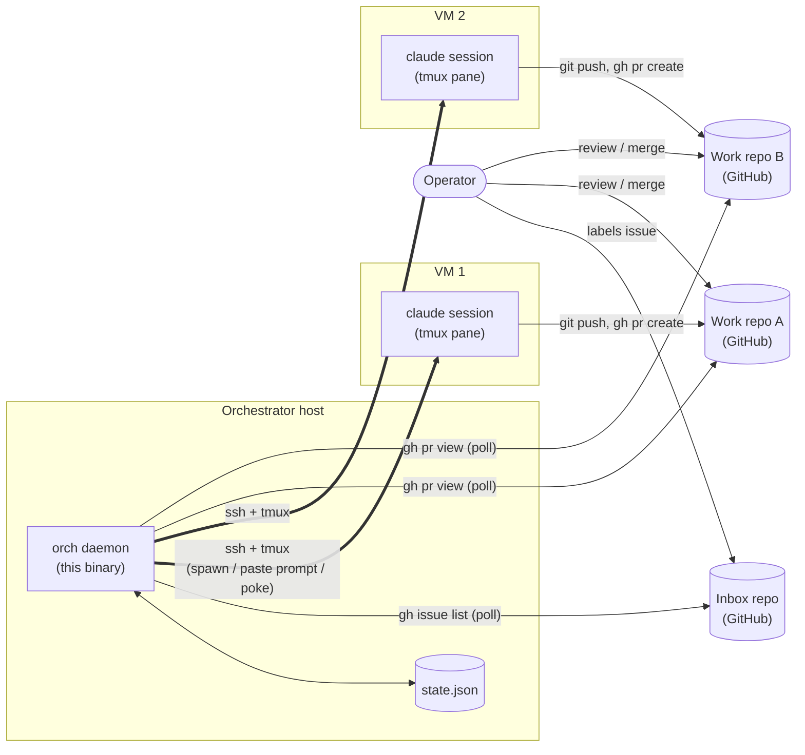
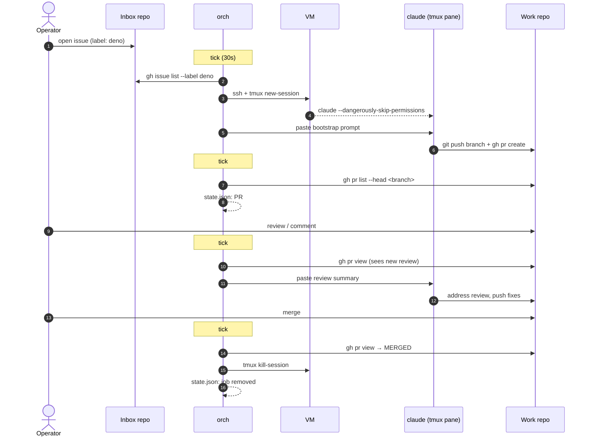

# orchid

Open a GitHub issue → orchid spawns a `claude` session on a free VM → claude opens a PR → orchid relays reviews and CI back to the pane → PR merged → session torn down.

Single Go binary. HCL config. No webhooks. Polls GitHub via `gh`, drives machines via SSH and tmux.

---

## Architecture



Everything is poll-driven on a single ticker (default 30s). No webhooks, no
queue, no message broker. Each tick, orch lists open labeled issues in the
inbox, spawns sessions for new ones on free VMs, and for in-flight jobs
checks the PR (or, for cron lifecycle, fires the next scheduled tick).

A typical oneshot run:



For cron-lifecycle jobs (see the cron section below if present) the
spawn/teardown loop fires every `schedule` instead of running once and
waiting for a PR.

---

## Quick start

```sh
go build -o orch .
GH_TOKEN=$(gh auth token) ./orch -config swarm.hcl
```

Keep it running:

```sh
tmux new -d -s orchid "GH_TOKEN=$(gh auth token) ./orch -config swarm.hcl 2>&1 | tee -a orch.log"
tail -f orch.log
```

State survives restarts — orchid resumes in-flight jobs from `state_file` on startup.

---

## Minimal config

```hcl
github {
  inbox_repo = "your-org/inbox"
}

orchestrator {
  poll_interval = "30s"
  state_file    = "/var/orch/state.json"
  branch_prefix = "orch/issue-"
  workdir_root  = "/home/orch/work"
  http_addr     = ":8000"        # status dashboard
  bot_login     = "mybot"        # default git user.name for commits
  bot_email     = "mybot@users.noreply.github.com" # default; falls back to <bot_login>@users.noreply.github.com
  ntfy_topic    = "mybot-abc123" # ntfy.sh push notifications (optional)
}

target "deno" {
  label = "deno"
  repo  = "denoland/deno"
}

bootstrap_prompt = <<EOT
You are working on GitHub issue #{{issue.number}} from {{inbox.repo}}: "{{issue.title}}"
The work repo is {{target.repo}}. You are in a fresh clone at {{workdir}} with SSH auth configured.

--- issue body ---
{{issue.body}}
--- end issue body ---

Plan, implement, commit, push to branch `{{branch}}`, and open a PR against {{target.repo}}.
Then stop and wait — orchid will send follow-up messages as reviews, comments, and CI arrive.
EOT

# Remote VM over SSH
vm "build-1" {
  host        = "build-1.example.com"
  user        = "deploy"
  key         = "~/.ssh/id_ed25519"
  capacity    = 2
  session_cmd  = "clawpatrol run -- claude --dangerously-skip-permissions"
  session_home = "/home/deploy"
}

# Localhost — orchestrator and sessions on the same machine
vm "local" {
  host        = "localhost"
  capacity    = 4
  session_cmd  = "runuser -u myuser -- clawpatrol run -- claude --dangerously-skip-permissions"
  session_home = "/home/myuser"
}
```

---

## Prerequisites

**On the orchestrator host:**

```sh
gh auth login          # or set GH_TOKEN; needs repo scope on inbox + target repos
ssh -T git@github.com  # key must authorize the bot account
```

**On each VM** — must be on PATH in a non-interactive shell:

```
tmux  git  jq  claude  clawpatrol (optional but recommended)
```

For remote VMs, orchid provisions GitHub SSH auth automatically at startup by copying the orch host's key to `~/.ssh/id_ed25519` on the VM. For localhost VMs the key is assumed to be present.

---

## VM fields

| Field | Default | Description |
|---|---|---|
| `host` | required | Hostname, IP, `localhost`, or `127.0.0.1`. |
| `user` | — | SSH user (remote VMs only). |
| `key` | — | SSH private key path (remote VMs only). |
| `capacity` | 0 (unlimited) | Max concurrent sessions on this VM. |
| `sccache` | false | Share `sccache` across sessions via tmux global env. |
| `sccache_dir` | `~/.cache/sccache` | Cache directory. |
| `session_cmd` | `clawpatrol run -- claude --dangerously-skip-permissions` | Command run inside the tmux pane. |
| `session_home` | `~` | Home dir of the session user (used to stamp claude's trust file). |
| `bot_login` | `orchestrator.bot_login` | Overrides the orchestrator-level git `user.name` for commits made on this VM. Use to give each VM a distinct bot identity. |
| `bot_email` | `orchestrator.bot_email`, else `<bot_login>@users.noreply.github.com` | Overrides the orchestrator-level git `user.email` for commits made on this VM. |

---

## Bootstrap prompt placeholders

| Placeholder | Value |
|---|---|
| `{{issue.number}}` | Issue number |
| `{{issue.title}}` | Issue title |
| `{{issue.body}}` | Issue body |
| `{{branch}}` | Branch name (e.g. `orch/issue-42`) |
| `{{target.name}}` | Target block name |
| `{{target.repo}}` | Work repo (e.g. `denoland/deno`) |
| `{{inbox.repo}}` | Inbox repo |
| `{{workdir}}` | Absolute path to the per-issue worktree on the VM |

Use `{{...}}` not `${...}` to avoid HCL variable interpolation.

---

## Workflow

```sh
# 1. Open an issue in the inbox repo with enough context in the body.
#    Add the label that matches the target repo.
gh issue create --repo your-org/inbox --label deno --title "..." --body "..."

# 2. Wait one poll_interval. Check the dashboard or log.
tail -f orch.log

# 3. Review the PR on the work repo. Orchid relays your comments automatically.
#    To stop early: close the inbox issue or remove the label.
gh issue close --repo your-org/inbox 42

# 4. Merge the PR. Orchid tears down the session on the next tick.
```

---

## Debugging

```sh
# Orchestrator state
cat state.json | jq

# Sessions on a remote VM
ssh build-1.example.com tmux ls
ssh build-1.example.com tmux attach -t claude-42 -r   # read-only

# Sessions on localhost
tmux ls
tmux attach -t claude-42 -r
```

Key log messages:

| Message | Meaning |
|---|---|
| `vm X: bootstrapped` | SSH key and GitHub auth confirmed |
| `issue #N: spawned on X/claude-N` | Session started, bootstrap prompt sent |
| `issue #N: found PR #M` | PR detected; orchid begins watching |
| `issue #N: poked PR #M` | Review/CI summary delivered to pane |
| `issue #N: pane busy, deferring poke` | Claude is mid-response; will retry |
| `issue #N: torn down` | Session killed, slot freed |

---

## Notifications

If `ntfy_topic` is set, orchid POSTs to `https://ntfy.sh/<topic>` when a PR opens and when it merges. Subscribe in the [ntfy app](https://ntfy.sh) to get phone notifications when work is ready for review.

---

## Caveats

- **One orchid instance per `state_file`.** No distributed locking.
- **Closing the work-repo PR does not close the inbox issue.** GitHub does not auto-close cross-repo. Close the inbox issue or remove the label to prevent orchid from respawning.
- **The idle heuristic is a tmux pane string match** (`"bypass permissions"` present, `"esc to interrupt"` absent). May need adjustment across claude TUI versions.
