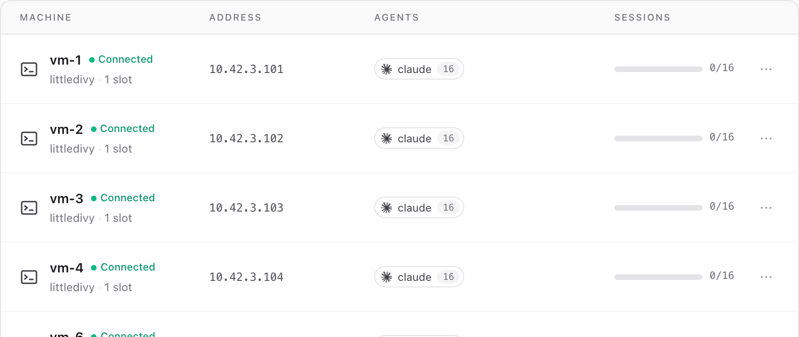
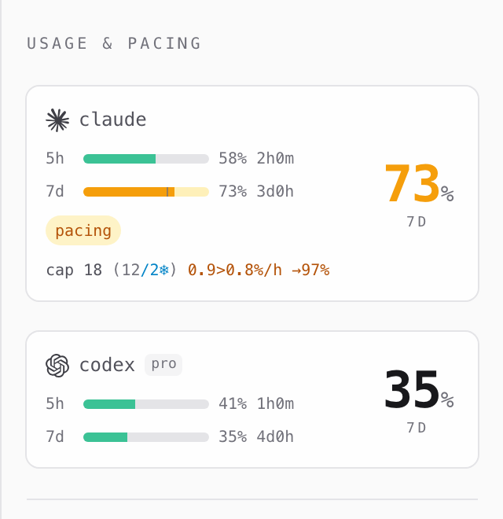
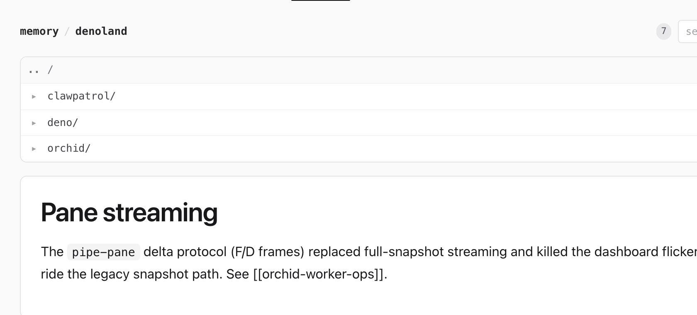

### orchid

High velocity coding agent orchestration


## What does it do?

File a GitHub issue, orchid spins up a coding agent to ship the PR — then
relays reviews and CI back into the session until it merges. Scale that
from one session to a whole fleet.

- **Scale** — from a couple of sessions to hundreds, fanned across every core you give it.
- **Load balancing** — run sessions across a cluster of machines over plain SSH.
- **Mix harnesses** — Claude, Codex, Pi, or opencode, side by side in one swarm.
- **Usage-limit throttle** — adaptive pacing against your weekly quota.
- **Shared memory** — Karpathy-style memory notes shared across the cluster.
- **Git-native** — prioritize and manage work through GitHub issues and PRs.

## Cluster

Add a machine, it joins the pool — orchid drives every box over plain SSH,
no agent or inbound ports on the workers. Sessions dispatch to whichever
host has a free slot; each can run a different agent.



## Usage-limit throttle

The governor paces the swarm against your 5-hour and weekly quota — braking
velocity as you approach the cap so you never run dry mid-flight. Each agent
account is metered independently.



## Memory

A git-backed, Karpathy-style note store the whole swarm reads and writes —
shared across repos, browsable as a tree, with backlinks between notes.



### Setup

The orch daemon runs on Linux (systemd + tmux + ssh). To self-host:

```bash
curl -fsSL https://orchid.littledivy.com/install.sh | bash
```

It builds the `orch` binary, writes a starter `swarm.hcl`, registers a
user-level systemd service, and prints your dashboard URL:

```
http://localhost:8000/?token=<secret>
```

## Documentation

https://orchid.littledivy.com/

## Configuration

See example [./swarm.hcl](swarm.hcl)

## Chat with your orchid

Point any chat-agent runtime (OpenClaw, Hermes, Claude Code) at
<https://orchid.littledivy.com/skill.md> and you get a
Telegram/Slack/Discord bot that knows your swarm. One paste:

```bash
npx -y @openclaw/cli@latest skill install https://orchid.littledivy.com/skill.md
```

See [docs/SUPERVISION.md](docs/SUPERVISION.md).
