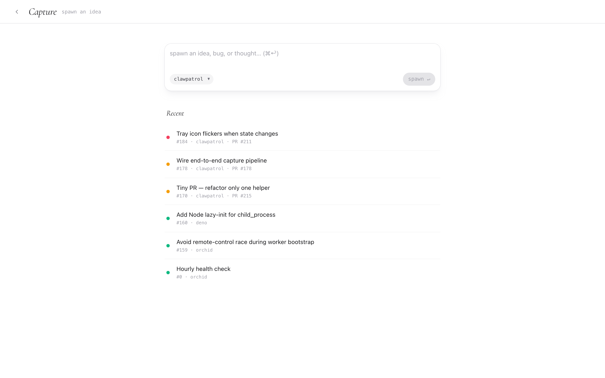

# Capture

{{diagram:capture}}



The bottleneck isn't writing the issue — it's getting the thought
into orchid before it evaporates. **Orchid Capture** is the
low-friction intake: a menu-bar app for macOS, a voice + share
extension on iOS, and a hold-to-record companion on watchOS. Each
posts JSON drafts to your orch's `/api/drafts`, which turns them
into labeled GitHub issues.

## Endpoint

```
POST /api/drafts
X-Capture-Token: <auth_token>
Content-Type: application/json

{
  "title": "fix: panic on empty input",
  "body":  "saw it again, full repro below",
  "label": "clawpatrol",
  "voice": "<base64 m4a, optional>",
  "image": "<base64 png, optional>"
}
```

Orch deduplicates, transcribes (if voice is attached), pushes any
attachments under `/captures/<id>`, and runs the equivalent of
`gh issue create` on the inbox repo with the supplied label.
Drafts get a generated issue body that links back to the asset URLs
so they survive the Mac going to sleep.

## Configure

Add a capture block to `swarm.hcl`:

```hcl
capture {
  auth_token  = "<32-hex; treat as a secret>"
  assets_dir  = "/home/divy/.orch/captures"
  public_url  = "https://<sub>.orchid.littledivy.com"
}
```

`auth_token` is the bearer the apps send. `public_url` is the
internet-reachable base URL — apps fetch images/voice via it. The
relay's per-user subdomain works out of the box.

## macOS menu-bar app

Install via TestFlight (or build from `capture/macos/`). On first
launch it asks for the orch URL + auth token; the dashboard
**Settings → Capture** page generates a one-tap `orchid://` URL
that auto-fills both. Watches `~/Desktop` for new screenshots,
ambient-captures clipboard, and gives you a global shortcut to open
a composer.

## iOS app + share extension

Voice draft → transcript → review → ship. The share extension means
any selected text / link / screenshot from another app becomes a
draft with one tap. The bundled watchOS companion uses
WatchConnectivity to pair: the phone pushes endpoint + token, and
from then on the watch posts directly to `/api/drafts` without
round-tripping through the phone.

## Capture-only mode

For local dev or to run only the intake server without polling
GitHub:

```bash
orch --config swarm.hcl --capture-only
```

Skips the swarm loop + VM bootstrap entirely. Useful when you want a
laptop-resident intake daemon and let a separate orch host on a VPS
do the actual dispatch.

See `capture/END_TO_END.md` in the repo for a three-command local
run-through.
