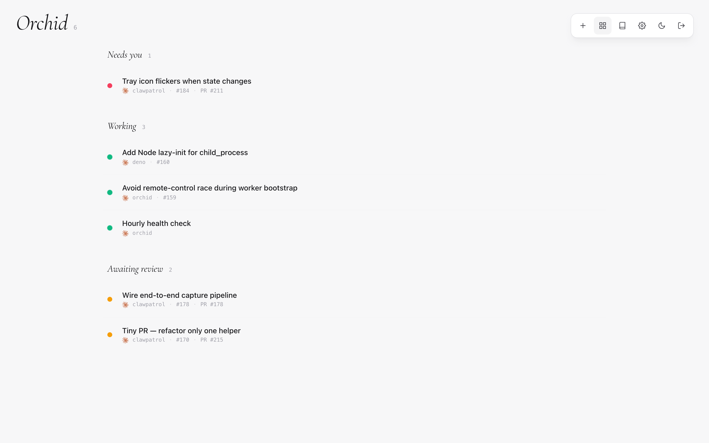

# Getting started



Orchid is a swarm of coding agents that ship pull requests. You file
issues; orchid spawns a `claude` (or codex) session for each one,
relays reviews and CI, and tears down once the PR merges. This guide
gets you from zero to your first merged PR in about five minutes.

## 1. Sign in

Visit [orchid.littledivy.com](https://orchid.littledivy.com) and click
**Sign in with GitHub**. After OAuth, you're given a personal
subdomain — `<your-github-handle>.orchid.littledivy.com` — and an
agent token.

## 2. Install on a machine

Pick the machine that will run the swarm. A Linux VPS, a Mac with
plenty of RAM, or a spare workstation all work. From that machine:

```bash
curl -fsSL https://orchid.littledivy.com/install.sh | bash
```

The installer is `bash`-only, runs as your normal user, and uses
`sudo` only to install package deps + enable `loginctl` linger. It
will:

- fetch a Go toolchain if one isn't already installed
- clone `denoland/orchid` into `$HOME/.orch/src`
- build the `orch` binary into `$HOME/.local/bin/orch`
- write a starter `$HOME/.orch/swarm.hcl`
- register a user-level systemd service that survives logout

Re-run it any time to update.

## 3. Join the relay

Back on the dashboard, copy the join command shown in the **Install**
modal. It looks like:

```bash
orch join wss://<your-handle>.orchid.littledivy.com/agent <token>
```

Run it on the same machine. The agent connects to the relay over a
single outbound WebSocket — no inbound ports, no public IP needed.

## 4. Open your first issue

In the inbox repo (the repo you point `github.inbox_repo` at, defaults
to your fork of `denoland/orchid`), file an issue with a label that
matches a `target` block — e.g. `clawpatrol`, `deno`, or whatever you
defined. Orchid sees the label on the next 30-second poll, picks a
free VM slot, clones the target repo, and starts a Claude session.

Watch progress on the dashboard. The session card flips through
*spawning → working → PR opened → reviewing → merged*. When you
review the PR (or CI fails), orchid pastes the feedback back into the
running pane so Claude can address it.

## What next

- [Configuration](/docs/configuration) — the `swarm.hcl` reference
- [Workers](/docs/workers) — scale to multiple VMs
- [Targets](/docs/targets) — route different labels to different repos
- [Supervision](/docs/supervision) — chat with your orchid from Telegram
